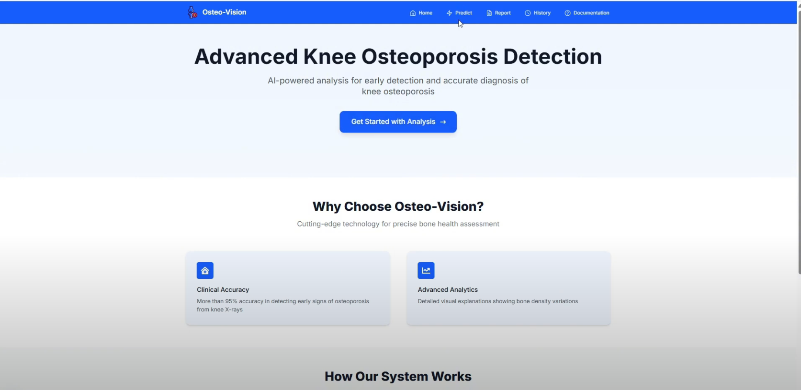
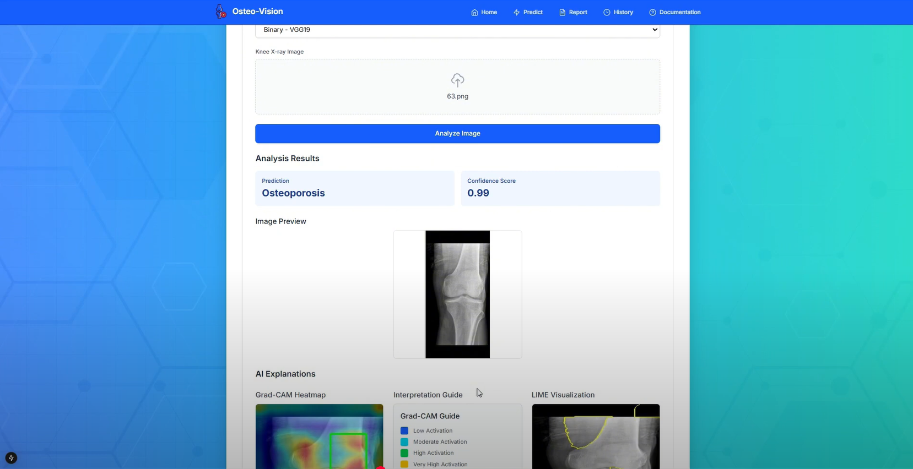

# 🦴 Knee Osteoporosis Detection with Explainable AI (Final Year Project)

This project is developed as part of my **Final Year Project** for the **BSc (Hons) Software Engineering** degree at the **University of Westminster**.
[Youtube Demonstration](https://www.youtube.com/watch?v=iuWW6EDt2kI&ab_channel=RavinduYasinthaWijesekara)
## 🎯 Project Overview

The aim of this project is to build a **Deep Learning-based Web Application** for detecting **knee osteoporosis** from **X-ray images**, with enhanced **explainability using Grad-CAM (Gradient-weighted Class Activation Mapping)**. This system empowers medical professionals by providing **automated diagnosis assistance** and **visual explanations**, improving trust and transparency in AI-driven medical decisions.

## 🌐 Frontend

## ⚙️ Key Features
- Upload X-ray images for instant osteoporosis predictions.
- Choose between multiple pre-trained CNN models (e.g., VGG19, EfficientNet, Ensemble model).
- View prediction labels and confidence scores.
- Visualize **Grad-CAM heatmaps** alongside the original X-ray image.
- User-friendly frontend built with **Next.js and React**.
- Backend powered by **FastAPI** (Python).
- Prediction history stored in **MongoDB** and accessible via frontend UI.
- **Toast notifications** for success/error messages.

## 🧠 Technologies Used
- Python, FastAPI, TensorFlow/Keras
- React, Next.js, TailwindCSS
- Axios, Dropzone
- MongoDB
- Grad-CAM and LIME for Explainable AI
---

## 👨‍💻 Author

Developed by [Ravindu Wijesekara](https://github.com/RaviyaLK) — Final Year SE Undergrad | AI + Backend Enthusiast

---
